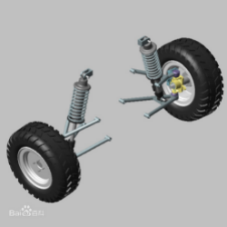
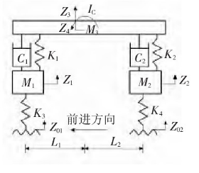

# 汽车悬架系统控制的建模与仿真分析

徐浩，杜浩哲，唐恺

(浙江大学 机械工程学院、控制科学与工程学院，浙江 杭州，310058）

 

(专业：机械电子工程（自动化交叉创新平台），自动化（机械电子工程交叉创新平台))

 

***\*摘  要\****:	随着技术的进步，汽车越来越注重使用者的驾驶感受，这其中汽车悬架系统起到了重要的作用。悬架系统就是指由车身与轮胎间的弹簧和避震器组成整个支持系统，其应有的功能是支持车身，改善乘坐的感觉。以汽车悬架为研究对象，对悬架系统进行数学建模，建立其动力学模型。然后将建立的模型进行诸如线性化等的处理，分析不同结构悬架系统、不同系统参数对于能控能观性的影响，并设计状态反馈控制器、PID控制器、观测器等，分析不同路况扰动下的系统特性，并且在数字控制方面考虑了设计离散状态下的控制器。

***\*关键词\*******\*:\****	汽车悬架系统 ；能控能观；状态反馈；PID控制；状态观测；数字控制

#  

***\*组员信息：\****

徐浩： [3180104398@zju.edu.cn](mailto:3180104398@zju.edu.cn)

杜浩哲：[3180102919@zju.edu.cn](mailto:3180102919@zju.edu.cn)

唐恺：  3180106039@zju.edu.cn

 

**
**

# **1**   ***\*问题描述和任务\****

我们选题是汽车悬架系统控制的建模与仿真分析，希望通过本次大作业完成以下几个任务的分析与求解：

（1）悬架系统数学建模。我们通过牛顿力学知识数学建模，对其动力学模型进行数学描述，分析主动、被动、半主动悬架，并且自己设计了一种改装悬架系统，一并与已经有的参考文献中的悬架系统进行对比分析，并且为了后续的分析方便，我们施加了一些约束，并使用一些简化方法完成了对数学模型的简化处理。

（2）能控性与能观性分析：在建立状态空间模型之后，我们利用线性空间的能控性和能观性的数学判据，分析不同的结构的悬架，不同的系统参数下悬架系统的能控性与能观性。

（3）控制器设计：通过分析我们的状态空间模型，我们计划完成状态反馈控制器、线性二次型最优控制器、PID控制器的相关设计，通过Simulink仿真进行实现与分析，并希望通过查阅文献等方式找到更多控制器的设计方式并进行学习和实现，然后可以人为施加扰动，模拟不同路况条件，对比不同控制器对汽车这一系统的影响。

（4）系统状态观测器设计：我们希望设计全维观测器、降维观测器等，进行不同极点配置比较，并比较有无观测器对系统的影响。

（5）新设计悬架系统分析：根据上述的各种能控能观、控制器、观测器分析与设计，我们对于新设计的悬架系统继续进行一定程度的改进，使之性能更符合要求。

（6）我们根据学过的数字控制的知识，考虑数字控制方面离散状态下的控制器内容。（待定）

# **2**   ***\*时间安排\****

***\*2020.12.9-2020.12.16  查阅相关文献资料，完成数学建模与状态空间模型构建，完成新设计的悬架系统初步设计\****

***\*2020.12.17-2020.12.24 完成能控性能观性分析，并且完成状态反馈控制器的设计\****

***\*2020.12.25-2021.1.1  完成相关最优控制器、PID控制器的设计，Simulink进行仿真；完成观测器设计\****

***\*2021.1.2-2021.1.9   对于新设计的悬架系统，分析其性能优劣，进行改进，检验改进后的性能\****

***\*2021.1.9-deadline   结合下半学期的数字控制知识，完成部分离散状态下控制器的内容；进行报告撰写\****
